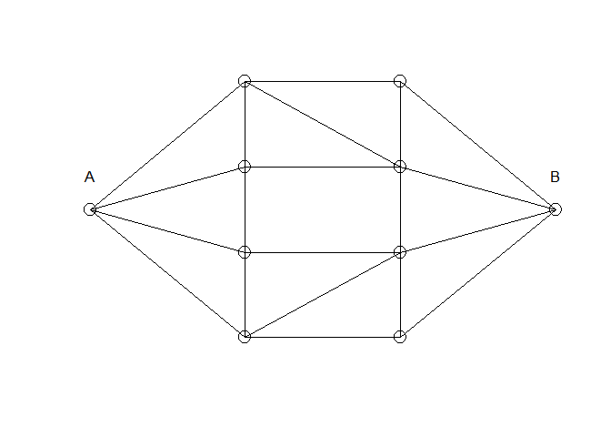
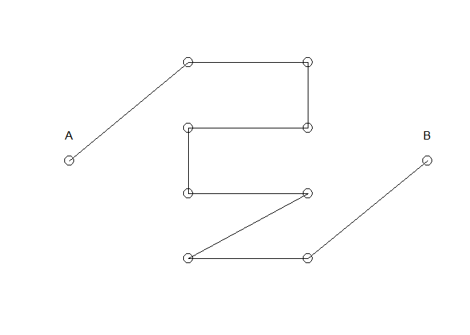
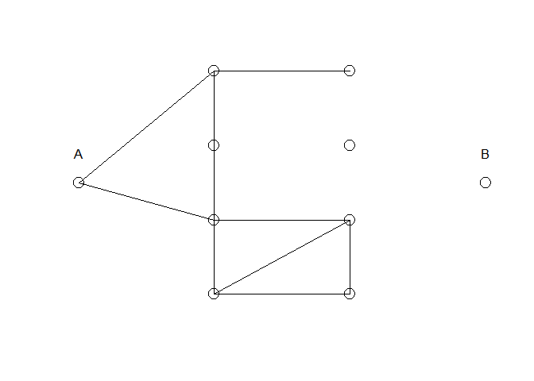

## Network Failure Problem

```r
MyPlot <- function(X){
  
  x <- c(0, rep(1, 4), rep(2, 4), 3)
  y <- c(1.5, 3:0, 3:0, 1.5)
  
  plot(x, y, axes=F, xlab="", ylab="", cex=2)
  text(c(0, 3), c(1.9, 1.9) ,c("A", "B"))
  
  if(X[1]==1) lines(0:1, c(1.5, 3)); if(X[2]==1) lines(0:1, c(1.5, 2))
  if(X[3]==1) lines(0:1, c(1.5, 1)); if(X[4]==1) lines(0:1, c(1.5, 0))
  if(X[5]==1) lines(c(1, 1), c(2, 3)); if(X[6]==1) lines(c(1, 1), c(1, 2))
  if(X[7]==1) lines(c(1, 1), c(0, 1)); if(X[8]==1) lines(c(1, 2), c(3, 3))
  if(X[9]==1) lines(c(1, 2), c(3, 2)); if(X[10]==1) lines(c(1, 2), c(2, 2))
  if(X[11]==1) lines(c(1, 2), c(1, 1)); if(X[12]==1) lines(c(1, 2), c(0, 1))
  if(X[13]==1) lines(c(1, 2), c(0, 0)); if(X[14]==1) lines(c(2, 2), c(2, 3))
  if(X[15]==1) lines(c(2, 2), c(1, 2)); if(X[16]==1) lines(c(2, 2), c(0, 1))
  if(X[17]==1) lines(c(2, 3), c(3, 1.5)); if(X[18]==1) lines(c(2, 3), c(2, 1.5))
  if(X[19]==1) lines(c(2, 3), c(1, 1.5)); if(X[20]==1) lines(c(2, 3), c(0, 1.5))
  
}

MyPlot( X = rep(1, 20) )
```

<!-- -->

### Network Failure Function

```r
Myh <- function(X){
  
  M <- diag(1, 10)
  for(i in 1:4){ M[1, i+1]<-X[i] }; for(i in 5:7){ M[i-3, i-2]<-X[i] }
  M[2, 6:7]<-X[8:9]; M[3, 7]<-X[10]; M[4:5, 8]<-X[11:12]; M[5, 9]<-X[13]
  for(i in 14:16){ M[i-8, i-7]<-X[i] }; for(i in 17:20){ M[i-11, 10]<-X[i] }
  for(i in 1:10){ for(j in i:10){ M[j, i] <- M[i, j] } }
  
  ifelse( (M%*%M%*%M%*%M%*%M%*%M%*%M%*%M%*%M)[1,10] > 0, 0, 1 )
  
}
```


#### Examples

```r
X1 <- c(1,0,0,0,0,1,0,1,0,1,1,1,1,1,0,0,0,0,0,1); MyPlot(X1); Myh(X1)
```



```
## [1] 0
```


```r
X2 <- c(1,0,1,0,1,1,1,1,0,0,1,1,1,0,0,1,0,0,0,0); MyPlot(X2); Myh(X2)
```



```
## [1] 1
```


### 1. Naive MC estimate of mu

```r
n <- 100000
p <- 0.05
X <- matrix(nrow=n, ncol=20)

for(i in 1:n){ X[i,] <- rbinom(20, 1, 1-p) }

(mu_MC <- mean(apply(X, 1, Myh)))
```

```
## [1] 1e-05
```

```r
(Var_MC <- (mu_MC*(1-mu_MC))/n)
```

```
## [1] 9.9999e-11
```

```r
(SE_MC <- sqrt(Var_MC))
```

```
## [1] 9.99995e-06
```

### 2. Importance Sampling

```r
p_star <- 0.5
X_star <- matrix(nrow=n, ncol=20)

for(i in 1:n){ X_star[i,] <- rbinom(20, 1, 1-p_star) }

b_star <- apply(X_star, 1, function(X) length(X[X==0]))
w_star <- ((1-p)/(1-p_star))^20*((p*(1-p_star))/(p_star*(1-p)))^b_star
h_star <- apply(X_star, 1, Myh)

#(unstandardized Importance Weight)
(mu_IS_star <- sum(h_star*w_star)/n)
```

```
## [1] 6.445508e-05
```

```r
(Var_IS_star <- var(h_star*w_star)/n)
```

```
## [1] 1.670976e-09
```

```r
(SE_IS_star <- sqrt(Var_IS_star))
```

```
## [1] 4.087757e-05
```

```r
#(standardized Importance Weight)
(mu_IS <- sum(h_star*(w_star/sum(w_star))))
```

```
## [1] 8.079754e-05
```

```r
(Var_IS <- (var(h_star*w_star) + mu_IS^2*var(w_star) - 2*mu_IS*cov(h_star*w_star, w_star))/n)
```

```
## [1] 2.446053e-09
```

```r
(SE_IS <- sqrt(Var_IS))
```

```
## [1] 4.945759e-05
```
